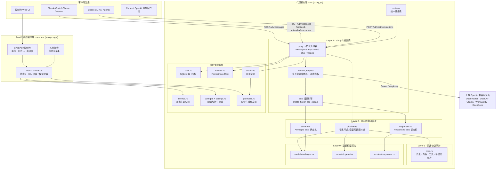
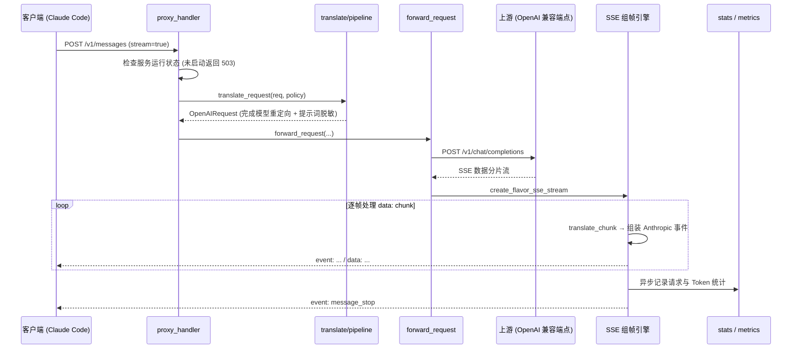

# proxy-rs

高性能多协议 AI 代理与网关，以轻量级 Tauri 2 桌面应用及独立 Rust 核心库分发。为 Claude Code、Claude Desktop、Codex 以及各类 AI 客户端提供多协议互通、智能路由、故障转移与全链路可观测性。

> **为什么从 anthropic-proxy 改名为 proxy-rs？**  
> 本项目最初专为将 Anthropic Messages API 翻译到 OpenAI 格式而构建。随着功能迭代，项目已全面演进为支持 **Anthropic Messages API**、**OpenAI Responses API**（Codex CLI 专用协议）、**OpenAI Chat Completions 直通**、多上游容灾故障转移、模型动态映射与安全指纹清洗的**全功能 AI 协议网关**。“anthropic” 单一前缀已无法代表本项目的技术边界与应用场景，因此正式更名为 **`proxy-rs`**。
>
> - **Rust 根包名**：`proxy-rs`
> - **代理核心库**：`proxy_rs`
> - **桌面客户端**：`proxy-rs-gui`（应用名 `Proxy RS`）

---

## 核心能力

### 1. 多协议互通与桥接
- **Anthropic Messages 协议**（`/v1/messages`）完整转换到 OpenAI Chat Completions：支持多轮对话、系统提示词、base64 格式多模态图片、工具调用（Function/Tool Calls）及工具执行结果回传。
- **双向 SSE 流式组帧**：毫秒级增量事件转换，完整模拟 Anthropic `message_start`、`content_block_delta`、`message_delta`、`message_stop` 事件生命周期。
- **OpenAI Responses 协议**（`/v1/responses`、`/backend-api/codex/responses`）：深度适配新一代智能体协议，供 Codex CLI 等工具直接接入第三方模型。
- **OpenAI Chat Completions 直通**（`/v1/chat/completions`）：无缝透传原生 OpenAI 请求并享受全局路由与统计能力。
- **扩展思考（Extended Thinking）**：智能识别客户端请求中的 `thinking` 参数，自动分流路由至专用的推理模型（`REASONING_MODEL`）。

### 2. 智能路由与上游容灾
- **多上游故障转移**：`UPSTREAM_BASE_URL` 支持分号（`;`）配置多个端点。仅在遇到 `429`（限流）或 `5xx`（服务故障）时自动重试下一可用端点，业务错误快速失败。
- **模型重映射（Model Mapping）**：通过 `PROXY_MODEL_MAP` 自由定义请求模型到上游模型的重定向规则（例如 `claude-sonnet-4-5=deepseek-chat`）。
- **灵活鉴权**：既支持全局静态上游密钥，也支持密钥透传模式（从请求头的 `x-api-key` 或 `authorization` 提取，适合多租户共享）。
- **内容清洗与安全指纹消除**：内置系统提示词敏感项剔除与请求体指纹中和能力，规避第三方服务商的安全策略误拦截（如腾讯 Copilot / WorkBuddy `11128` 拦截）。
- **长会话大报文保护**：默认支持高达 32 MiB 请求体缓冲（`PROXY_MAX_BODY_BYTES`），彻底解决复杂长对话客户端中断与截断痛点。

### 3. 企业级可观测性
- **SQLite 每日统计**：内置本地 SQLite 存储，自动统计请求量、成功/失败率、Input / Output Token、缓存读写（Prompt Cache Read/Write）及命中率。
- **Prometheus 指标端点**：提供标准 `GET /metrics`，便于接入 Grafana 等现代可观测系统。
- **结构化错误解析**：将上游网关晦涩的错误码（如 11128）解析为中文友好排查提示。
- **实时日志流**：桌面控制台高吞吐实时日志缓冲 + `~/.proxy-rs/logs/proxy.log` 持久化。

### 4. 极致桌面与原生体验
- **系统托盘常驻**：原生托盘图标实时展示服务运行状态，支持一键启停，关闭主窗口后台静默运行。
- **三栏现代化控制台**：运行状态总览 / 实时交互日志 / 服务配置面板，支持快捷键呼出 `⌘K` 快捷命令。
- **生态一键联动**：一键将代理地址与模型映射写入 `~/.claude/settings.json`，即开即用。
- **macOS LaunchAgent**：原生支持开机自启无缝守护，优雅重启与单一实例防冲突。

---

## 系统架构



### 请求时序图（以 `/v1/messages` 流式对话为例）



---

## 快速开始

### 依赖环境
- **Rust**: 推荐使用最新稳定版（[rustup.rs](https://rustup.rs)）
- **Node.js**: 用于 Tauri CLI
- **Task**: 可选，推荐使用任务运行器（[taskfile.dev](https://taskfile.dev)）

### 常用命令

使用 Task：
```bash
task setup       # 安装固定版本的 Tauri CLI (npm ci)
task dev         # 启动本地开发桌面客户端 (端口 3477，数据隔离)
task build       # 构建 macOS 应用程序 (.app)
task build-dmg   # 打包生成 dmg 安装镜像
task install     # 构建并安装到 /Applications (运行中自动热重启)
task check       # 代码检查 (fmt + clippy + test)
```

使用 npm / cargo：
```bash
npm ci
npm run dev
npm run build
npm run build:dmg
cargo test
```

### 客户端接入配置

#### 1. Claude Code
直接在启动命令前指定代理环境变量：
```bash
ANTHROPIC_BASE_URL=http://localhost:3456 claude
```
或者在 `Proxy RS` 桌面端「服务设置」中点击 **“写入 Claude 配置”**，自动将 `~/.claude/settings.json` 指向本地代理。

#### 2. Codex CLI
在 `~/.codex/config.toml` 中配置：
```toml
[model_providers.proxy_rs]
base_url = "http://127.0.0.1:3456"
wire_specification = "responses"
```

#### 3. 原生 Curl 测试
```bash
curl -X POST http://localhost:3456/v1/messages \
  -H "Content-Type: application/json" \
  -H "x-api-key: your-upstream-api-key" \
  -d '{
    "model": "claude-sonnet-4-5",
    "max_tokens": 1024,
    "messages": [{"role": "user", "content": "你好，请介绍一下你自己。"}]
  }'
```

---

## 配置与持久化

### 配置加载优先级
**环境变量 / `.env` 文件** 优先于 **`~/.proxy-rs/gui-settings.json`**（桌面端保存的图形化配置）。

`.env` 搜索顺序（命中第一个存在的即生效）：
1. `./.env`（当前工作目录）
2. `~/.proxy-rs/.env`
3. `~/.proxy-rs.env`
4. `~/.anthropic-proxy.env`（向后兼容）
5. `/etc/proxy-rs/.env`
6. `/etc/anthropic-proxy/.env`（向后兼容）

### 环境变量速查表

| 环境变量 | 必填 | 默认值 | 说明 |
|---|:---:|:---:|---|
| `UPSTREAM_BASE_URL` | **是** | - | 上游端点地址，支持使用 `;` 分隔配置多个以启用故障转移 |
| `UPSTREAM_API_KEY` | 否* | - | 上游 API 认证密钥 |
| `UPSTREAM_API_KEY_PASSTHROUGH` | 否 | `false` | 透传模式：直接从客户端请求头 `x-api-key` 提取密钥 |
| `PORT` | 否 | `3456` | 本地代理监听端口（冲突时支持自动回退） |
| `PROXY_BIND` | 否 | `127.0.0.1` | 监听绑定网卡 IP（兼容 `ANTHROPIC_PROXY_BIND`） |
| `PROXY_MODEL_MAP` | 否 | - | 模型映射规则，格式为 `src1=target1;src2=target2`（兼容 `ANTHROPIC_PROXY_MODEL_MAP`） |
| `PROXY_SYSTEM_PROMPT_IGNORE_TERMS` | 否 | - | 转发前剔除的系统提示词片段，分号或换行分隔（兼容旧变量） |
| `PROXY_MAX_BODY_BYTES` | 否 | `33554432` (32 MiB) | 请求体缓冲上限（字节），超出返回 413（兼容旧变量） |
| `REASONING_MODEL` | 否 | 客户端请求模型 | 请求包含思考参数时强制分流使用的模型 |
| `COMPLETION_MODEL` | 否 | 客户端请求模型 | 普通请求使用的缺省上游模型 |
| `CREDITS_API_ENDPOINT` | 否 | - | 查询额度余额的网关专有端点 |
| `DEBUG` / `VERBOSE` | 否 | `false` | 开启调试模式 / 打印完整请求与响应体报文 |

\* 上游需要鉴权时必填。当启用 `UPSTREAM_API_KEY_PASSTHROUGH=true` 时，不得同时指定 `UPSTREAM_API_KEY`。

### 数据持久化目录

应用的所有状态数据均存储于用户主目录下的 `~/.proxy-rs/` 中，更新升级应用不丢失：

| 文件路径 | 说明 |
|---|---|
| `~/.proxy-rs/gui-settings.json` | 桌面客户端持久化的图形化设置（厂商、端口、模型等） |
| `~/.proxy-rs/.env` | 偏好的上游地址与密钥环境文件（可选） |
| `~/.proxy-rs/logs/proxy.log` | 全量请求日志、错误排查堆栈与系统事件 |
| `~/.proxy-rs/stats.db` | 本地 SQLite 每日请求与 Token 统计数据库 |

---

## HTTP 接口全览

所有接口在 `src/router.rs` 中集中注册并由单一 Axum 路由器提供服务：

| 方法 | 请求路径 | 说明 |
|---|---|---|
| POST | `/v1/messages` | **Anthropic Messages API**（流式 / 非流式完整翻译） |
| POST | `/v1/responses`<br/>`/responses`<br/>`/backend-api/codex/responses` | **OpenAI Responses API**（Codex CLI 专用桥接） |
| POST | `/v1/chat/completions`<br/>`/chat/completions` | **OpenAI Chat Completions**（原生直通转发与容灾） |
| GET | `/v1/models`<br/>`/models` | **模型列表**（Anthropic 格式，支持聚合发现） |
| GET | `/v1/credits`<br/>`/credits` | **网关额度与钱包余额**查询 |
| GET | `/health` | **健康检查探针**，返回 `OK`（状态码 200） |
| GET | `/metrics` | **Prometheus 监控指标**导出 |

---

## 模块分层与代码架构

项目遵循严格的**四层函数式分层架构**，确保翻译核心的高内聚与可测性：

```
src/                       # 代理核心库 crate: proxy_rs（纯 Rust，无 GUI 依赖）
  models/                  # Layer 0：纯契约数据模型（Anthropic / OpenAI / Responses）
  translate/               # Layer 1–2：纯函数转换管道（无任何 I/O、无 async、无 logging）
    core.rs                #   Layer 1：消息角色、多模态图片、工具定义原子转换
    pipeline.rs            #   Layer 2a：请求/响应体结构装配与策略执行
    stream.rs              #   Layer 2b：Anthropic SSE 状态机与事件组帧
    responses.rs           #   Layer 2b：OpenAI Responses SSE 事件转换器
  proxy.rs                 # Layer 3：HTTP Handler、多上游故障转移、SSE 组帧
  router.rs                # Layer 3：路由定义（系统所有路由的唯一注册点）
  service.rs               # Layer 3：后台服务控制器与启停生命周期
  config.rs                # Layer 3：配置合并与环境变数加载
  settings.rs              # Layer 3：持久化配置读写与环形日志缓冲
  stats.rs                 # Layer 3：SQLite 每日用量统计持久层
  credits.rs               # Layer 3：余额查询适配层
  providers.rs             # Layer 3：预置厂商模板与动态模型发现
  metrics.rs               # Prometheus 指标注册与埋点
  util.rs                  # 报文裁剪、日期计算、请求头脱敏工具类
  error.rs                 # 错误枚举及标准 HTTP 响应映射
src-tauri/                 # 桌面客户端 crate: proxy-rs-gui
  src/main.rs              # Tauri 2 原生集成、系统托盘、进程单例、LaunchAgent 管理
ui/                        # 桌面端前端（现代化原生 HTML/CSS/JS，无多余构建复杂度）
tests/                     # 集成测试集（报文长度限制测试、端点脱敏测试等）
```

### 开发约定与架构规范
1. **纯函数核心**：`models/` 与 `translate/` 层绝对禁止引入任何 I/O、异步操作（async）与日志输出，仅包含纯类型与算法映射，保证 100% 可单测。
2. **唯一路由注册点**：所有端点只能在 `router.rs::build_app_router` 中添加，确保任何前端、测试或无头模式能自动同步获得相同接口。
3. **单向上游收敛**：无论客户端走 Anthropic、Responses 还是 Chat Completions 协议，全部在 `proxy.rs::forward_request` 收敛，共享同一套重试、超时、密钥注入与统计逻辑。

---

## 许可证

本项目基于 **MIT License** 开源，详情请参阅 [LICENSE](LICENSE)。

本项目基于 [m0n0x41d/anthropic-proxy-rs](https://github.com/m0n0x41d/anthropic-proxy-rs) 进行深度重构与二次开发。根据 MIT 许可证条款，保留原始版权声明并附录本项目修改声明：

```text
Copyright (c) 2025 m0n0x41d (Ivan Zakutnii) — original work
Copyright (c) 2026 yudong22 (孙东) — modifications and this distribution
```
