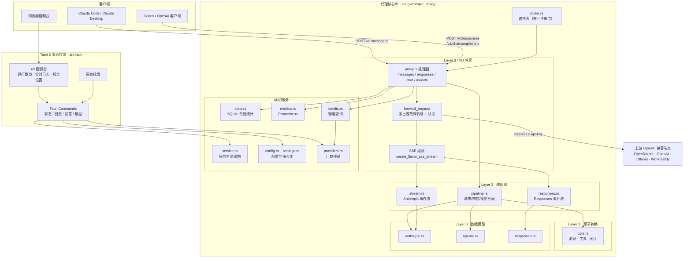
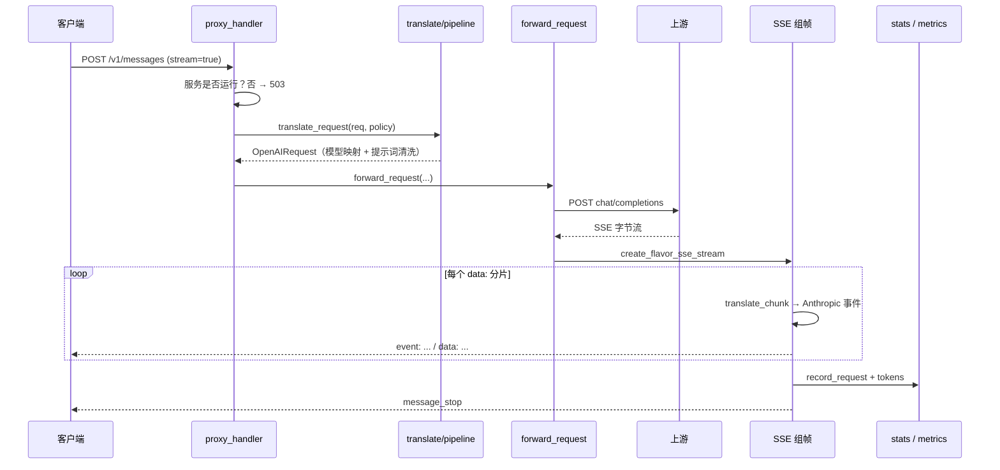

# proxy-rs

把 **Anthropic API** 请求翻译成 **OpenAI 兼容**格式的高性能 Rust 代理，以 Tauri 2 桌面应用形式分发。让 Claude Code、Claude Desktop 及任意 Anthropic 客户端可以接入 OpenRouter、OpenAI、Ollama、WorkBuddy 等 OpenAI 兼容服务。

> 包名 `proxy-rs`，代理核心库为 `anthropic_proxy`，桌面应用为 `anthropic-proxy-gui`。

---

## 功能与特色

**协议转换**
- Anthropic Messages API（`/v1/messages`）→ OpenAI Chat Completions，覆盖文本、系统提示、base64 图片、工具调用与工具结果
- Anthropic SSE 事件流双向转换，流式输出增量实时透传
- 额外兼容 OpenAI **Responses API**（`/v1/responses`，供 Codex 类客户端使用）与 Chat Completions **直通**转发
- 扩展思考（extended thinking）：自动识别请求中的 `thinking` 参数并路由到 `REASONING_MODEL`

**路由与凭据**
- 多上游**故障转移**：`UPSTREAM_BASE_URL` 用 `;` 分隔多个端点，按序重试
- 仅对 429 / 5xx 重试下一个上游，其余错误快速失败
- 模型映射 `ANTHROPIC_PROXY_MODEL_MAP`（`source=target`），在推理/补全模型选择之后应用
- 密钥**透传**模式：按请求从 `x-api-key` 提取，支持多租户
- 系统提示词清洗：按配置移除指定词条后再转发上游

**可观测性**
- 实时日志窗口与 `~/.proxy-rs/logs/proxy.log` 持久化
- SQLite 每日统计：请求数、成功/失败、输入/缓存读/缓存写/输出 token、缓存命中率
- Prometheus 指标：`GET /metrics`（请求数、时延、token、上游错误）
- 上游错误结构化解析：WorkBuddy 业务码（如 `11128`）附带中文提示

**桌面体验**
- 系统托盘常驻，可启停服务；关闭窗口不退出
- 三栏控制台：运行概览 / 实时日志 / 服务设置（含快捷菜单 `⌘K`）
- 一键写入 `~/.claude/settings.json`，把模型槽位指向本代理
- 开机自启（macOS LaunchAgent）、上游连通性测试

**工程特色**
- 单一代理核心库，所有路由只在 `router.rs` 注册一次
- 三类 API、流式与非流式共 6 条链路收敛到 1 个上游转发函数
- 纯函数式翻译层（无 I/O、无 async、无日志），便于单测；115 个测试覆盖

---

## 系统架构



**请求链路**（以 `/v1/messages` 流式为例）



---

## 快速开始

**依赖**：Rust（[rustup](https://rustup.rs)）、Node.js（用于 Tauri CLI）、[Task](https://taskfile.dev)（可选）。

```bash
task setup     # npm ci，安装锁定版本的 Tauri CLI
task dev       # 开发模式启动
task build     # 构建 .app
task install   # 构建并安装到 /Applications（运行中会重启）
```

不使用 Task 时：

```bash
npm ci
npm run dev
npm run build
npm run build:dmg
```

首次启动后在「服务设置」里选择厂商、填写 API Key 并保存，然后启动服务。把客户端指向代理即可：

```bash
ANTHROPIC_BASE_URL=http://localhost:3456 claude
```

---

## 配置

优先级：**环境变量 / `.env` → 覆盖 `~/.proxy-rs/gui-settings.json` 中的应用设置**。

`.env` 搜索顺序：`./.env` → `~/.proxy-rs/.env` → `~/.anthropic-proxy.env` → `/etc/anthropic-proxy/.env`（取第一个存在的）。

| 变量 | 必填 | 默认 | 说明 |
|------|------|------|------|
| `UPSTREAM_BASE_URL` | **是** | - | OpenAI 兼容端点，多个用 `;` 分隔实现故障转移 |
| `UPSTREAM_API_KEY` | 否* | - | 上游密钥 |
| `UPSTREAM_API_KEY_PASSTHROUGH` | 否 | `false` | 按请求从 `x-api-key` 提取密钥 |
| `PORT` | 否 | `3456` | 代理端口（占用时回退 `3457`） |
| `ANTHROPIC_PROXY_BIND` | 否 | `127.0.0.1` | 监听地址 |
| `ANTHROPIC_PROXY_MODEL_MAP` | 否 | - | 模型映射，如 `a=gpt-4.1;b=gpt-4.1-mini` |
| `ANTHROPIC_PROXY_SYSTEM_PROMPT_IGNORE_TERMS` | 否 | - | 转发前移除的系统提示词条（`;` 或换行分隔） |
| `REASONING_MODEL` | 否 | 用请求模型 | 开启思考时使用的模型 |
| `COMPLETION_MODEL` | 否 | 用请求模型 | 普通请求使用的模型 |
| `CREDITS_API_ENDPOINT` | 否 | - | `/v1/credits` 的网关额度端点 |
| `ANTHROPIC_PROXY_MAX_BODY_BYTES` | 否 | `33554432`（32 MiB） | 请求体上限（字节）。超出返回 `413` |
| `DEBUG` / `VERBOSE` | 否 | `false` | 调试日志 / 完整请求响应体日志 |

\* 上游需要鉴权时必填。`UPSTREAM_API_KEY_PASSTHROUGH=true` 与 `UPSTREAM_API_KEY` 互斥，同时设置会拒绝启动。

请求体上限说明：长会话的 Claude Code 请求体可以超过 2 MB，因此默认放宽到 32 MiB。超限时返回 `413`
并说明当前上限与调整方式；请求体本身读失败（客户端中断连接）返回 `400`。两种情况都会写入
`proxy.log`、GUI 控制台与请求统计，不会静默消失。

`UPSTREAM_BASE_URL` 支持三种形式：

- 服务根地址 `https://api.openai.com` → `/v1/chat/completions`
- 带版本 `https://gateway.internal/v2` → `/v2/chat/completions`
- 完整端点 `https://gateway.internal/v2/chat/completions` → 原样使用

含查询参数、片段或半截路径（如 `.../chat`）会被拒绝。

### 数据目录

全部状态位于 `~/.proxy-rs/`，重装应用不丢失：

| 路径 | 内容 |
|------|------|
| `gui-settings.json` | 应用内保存的厂商、端口、模型等 |
| `.env` | 上游地址与密钥（可选） |
| `logs/proxy.log` | 请求与事件日志 |
| `stats.db` | SQLite 每日统计 |

### 内置厂商预设

`workbuddy-cn`（默认）、`openai`、`openrouter`、`ollama`，也可填自定义端点。

---

## HTTP 接口

| 方法 | 路径 | 说明 |
|------|------|------|
| POST | `/v1/messages` | Anthropic Messages API |
| POST | `/v1/responses`、`/responses`、`/backend-api/codex/responses` | OpenAI Responses API |
| POST | `/v1/chat/completions`、`/chat/completions` | OpenAI Chat Completions 直通 |
| GET | `/v1/models`、`/models` | 模型列表（Anthropic 格式） |
| GET | `/v1/credits`、`/credits` | 网关额度余额 |
| GET | `/health` | 健康检查，返回 `OK` |
| GET | `/metrics` | Prometheus 指标 |

```bash
curl -X POST http://localhost:3456/v1/messages \
  -H "Content-Type: application/json" \
  -H "x-api-key: $UPSTREAM_API_KEY" \
  -d '{"model":"claude-sonnet-4-5","max_tokens":256,
       "messages":[{"role":"user","content":"你好"}]}'
```

**已知限制**：暂不支持 `tool_choice`（固定 `auto`）、`service_tier`、`metadata`、`context_management`、`container`、引用（citations）、`pause_turn`/`refusal` 停止原因，以及 Batches / Files / Admin API。

---

## 扩展开发

### 代码结构

```
src/                   # 代理核心库 anthropic_proxy（无 GUI 依赖）
  models/              # Layer 0：Anthropic / OpenAI / Responses 数据模型
  translate/           # Layer 1–2：纯函数翻译
    core.rs            #   消息、工具、图片原子转换
    pipeline.rs        #   请求、响应、模型列表
    stream.rs          #   Anthropic SSE 事件流
    responses.rs       #   Responses SSE 事件流
  proxy.rs             # Layer 3：HTTP 处理器 + 统一上游转发 + SSE 组帧
  router.rs            # Layer 3：路由表（唯一注册点）
  service.rs           # Layer 3：服务生命周期
  config.rs            # Layer 3：配置构建（含环境变量覆盖）
  settings.rs          # Layer 3：持久化设置、日志缓冲
  stats.rs             # Layer 3：SQLite 每日统计
  credits.rs           # Layer 3：网关额度
  providers.rs         # Layer 3：厂商预设与模型发现
  metrics.rs           # Prometheus 指标
  util.rs              # 通用助手（truncate、日期、请求头）
  error.rs             # 错误类型与 HTTP 映射
src-tauri/src/main.rs  # 桌面应用：Tauri 命令 + 系统托盘
ui/                    # 控制台前端（原生 HTML/CSS/JS，无构建步骤）
```

### 分层约定

1. Layer 1/2（`translate/`、`models/`）**不含 I/O、async、日志**，全部为可单测纯函数
2. Layer 3 只做接线，不含业务逻辑
3. `translate/` 不反向依赖 `proxy.rs` / `config.rs` / `router.rs` / `settings.rs`
4. 所有路由只在 `router.rs` 注册一次
5. 桌面应用必须通过 `Config::from_settings` 构建配置，不得自行拼装

### 常见扩展

**新增厂商**：在 `src/providers.rs` 的 `builtin_presets()` 增加一条 `ProviderPreset`（含 `chat_completions_url`，如有厂商私有模型目录则填 `models_config_url`）。

**新增路由**：在 `src/router.rs` 的 `build_app_router()` 添加 `.route(...)`，桌面应用与任何前端自动获得该路由。

**新增协议支持**：在 `src/models/` 定义数据模型，在 `src/translate/` 写纯函数翻译，再在 `src/proxy.rs` 的 `ApiFlavor` 增加一个分支——上游转发、重试、SSE 组帧与统计会复用现有实现。

**新增 Tauri 命令**：在 `src-tauri/src/main.rs` 写 `#[tauri::command]`，注册到 `invoke_handler`，再在 `ui/app.js` 中用 `invoke(...)` 调用。

### 开发命令

```bash
task test        # cargo test
task check       # fmt + clippy + test
task lint        # clippy -D warnings
task fmt         # cargo fmt
task help        # 查看全部任务
```

提交前请确保 `task check` 通过（CI 同样执行 `fmt --check`、`clippy -D warnings`、`cargo test`）。

---

## 许可

MIT License，详见 [LICENSE](LICENSE)。

本项目基于 [m0n0x41d/anthropic-proxy-rs](https://github.com/m0n0x41d/anthropic-proxy-rs) 二次开发。按 MIT 许可要求，原始版权声明予以保留，并在此声明本发行版的修改：

```
Copyright (c) 2025 m0n0x41d (Ivan Zakutnii) — original work
Copyright (c) 2026 yudong22 (孙东) — modifications and this distribution
```
